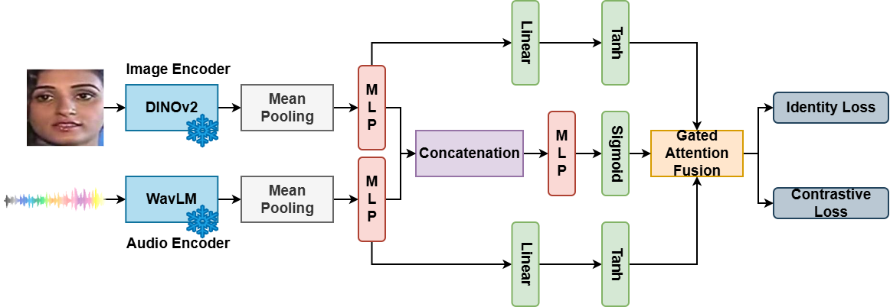

# Contrastive Gated Fusion for Multilingual Speaker Verification

This repository contains the implementation for the FAME Challenge 2026, which addresses cross-modal face-voice verification in multilingual environments. Our system achieved **4th place** with an overall Equal Error Rate (EER) of **33.2%** on the MAV-Celeb v3 English-German dataset.

## Overview

Understanding face-voice relationships in multilingual contexts is challenging due to the difficulty of transferring cross-modal models across different languages. This work presents a framework designed to remain robust under language shifts through targeted architectural choices and training strategies.

### Key Features

- Frozen pretrained encoders (DINOv2-Giant for images, WavLM-Large for audio)
- Lightweight MLP adapters with normalization layers
- Gated attention fusion mechanism for cross-modal alignment
- Joint optimization with cross-entropy and contrastive (Orthogonal Projection Loss) objectives
- Support for distributed multi-GPU training

## Architecture



The framework consists of:

1. **Pretrained Encoders (Frozen)**
   - **Image Branch**: DINOv2-Giant extracts visual features from face images
   - **Audio Branch**: WavLM-Large extracts acoustic features from speech

2. **Mean Pooling**: Temporal/spatial pooling to obtain fixed-size representations

3. **MLP Adapters**: Lightweight projection layers that map encoder outputs to a shared embedding space

4. **Gated Attention Fusion**:
   - **Concatenation Path**: MLP followed by Sigmoid to compute attention weights (alpha)
   - **Transform Paths**: Linear + Tanh for both audio and image embeddings
   - **Fusion**: `f_fused = alpha * f_audio + (1 - alpha) * f_image`

5. **Dual Loss Objectives**:
   - **Identity Loss**: Cross-entropy for person classification
   - **Contrastive Loss**: Orthogonal Projection Loss (OPL) for embedding alignment

### Gated Attention Fusion

The fusion mechanism combines audio and image embeddings using learned attention weights:

1. Concatenate audio and image embeddings (512d)
2. Pass through attention network to obtain weights alpha in [0, 1]
3. Transform audio/image embeddings via linear layers with tanh activation
4. Compute gated combination: `f_fused = alpha * f_audio + (1 - alpha) * f_image`

### Loss Function

The total loss combines classification and contrastive objectives:

```
L_total = L_CE + alpha * L_OPL
```

Where:
- `L_CE`: Cross-entropy loss for identity classification (50 classes)
- `L_OPL`: Orthogonal Projection Loss that maximizes positive pair similarity and minimizes negative pair similarity
- `alpha`: Weight for contrastive loss (default: 1.0)

## Project Structure

```
.
├── datasets/
│   └── mavceleb_encoded.py     # Dataset class for pre-encoded features
├── models/
│   └── crossmodal_verification.py  # Model architecture
├── encode_mavceleb.py          # Script to encode raw data with pretrained models
├── encode_missing.py           # Utility to encode missing files
├── train_crossmodal.py         # Training script with DDP support
├── test_crossmodal.py          # Testing and evaluation script
├── train_crossmodal_English.sh # Training script for English
├── train_crossmodal_German.sh  # Training script for German
├── run_encoding.sh             # Shell script for feature encoding
└── requirements.txt            # Python dependencies
```

## Requirements

- Python 3.8+
- PyTorch 1.10+
- CUDA-capable GPU(s)

Install dependencies:

```bash
pip install -r requirements.txt
```

Key dependencies:
- torch, torchaudio, torchvision
- transformers (for loading pretrained models)
- numpy, scipy, scikit-learn

## Dataset

This project uses the **MAV-Celeb v3** dataset, which contains:
- 50 distinct person identities
- English and German speech samples
- Paired facial images

### Download Links

**Raw Data (faces and voices):**
- [MAV-Celeb Dataset (Google Drive)](https://drive.google.com/drive/folders/1OJyjXJULErvrvzLQmpJn5v8rRo0n_fod?usp=sharing)
  - `mavceleb_v3_train.zip` (1.58 GB) - Training faces and voices
  - `mavceleb_v3_test.zip` (286.1 MB) - Test faces and voices

**Train/Test Splits:**
- [Data Splits (Google Drive)](https://drive.google.com/drive/folders/1MEHtEVh9lSa9hNZxjEfNJnE3qrpm_PKw?usp=sharing)
  - `v3/` folder contains the English-German split files

### Data Preparation

1. Download the MAV-Celeb v3 dataset
2. Organize the data with the following structure:

```
MAV-Celeb_v3/
├── faces/           # Training face images
│   └── id0001/
│       └── English/
│           └── video_id/
│               └── 000000100.jpg
├── voices/          # Training audio files
│   └── id0001/
│       └── English/
│           └── video_id/
│               └── 00000.wav
├── English_test/    # English test data
│   ├── face/
│   └── voice/
├── German_test/     # German test data
│   ├── face/
│   └── voice/
└── v3/              # Data split files
    ├── English_train.txt
    ├── German_train.txt
    ├── English_test.txt
    └── German_test.txt
```

### Feature Pre-encoding

To reduce training time, we pre-extract features from frozen pretrained encoders:

```bash
python encode_mavceleb.py \
    --data_root /path/to/MAV-Celeb_v3 \
    --output_root /path/to/MAV-Celeb_v3/Pre-encoded \
    --dinov2_path /path/to/dinov2-giant \
    --wavlm_path /path/to/wavlm-large \
    --num_gpus 2 \
    --num_workers 12
```

This will create:
- `Pre-encoded/faces/`: DINOv2-Giant features (1, 257, 1536) per image
- `Pre-encoded/voices/`: WavLM-Large features (1, T, 1024) per audio

## Training

### Single Language Training

Train on English:

```bash
bash train_crossmodal_English.sh
```

Train on German:

```bash
bash train_crossmodal_German.sh
```

### Manual Training

```bash
python -m torch.distributed.launch \
    --nproc_per_node=2 \
    --use-env \
    train_crossmodal.py \
    --data_file /path/to/English_train.txt \
    --encoded_root /path/to/Pre-encoded \
    --data_root /path/to/MAV-Celeb_v3 \
    --batch_size 512 \
    --epochs 100 \
    --lr 1e-4 \
    --min_lr 1e-6 \
    --warmup_epochs 5 \
    --alpha 1.0 \
    --output_dir ./saved/model/crossmodal_verification
```

### Training Parameters

| Parameter | Value | Description |
|-----------|-------|-------------|
| Learning Rate | 1e-4 (max), 1e-6 (min) | Cosine scheduler with warmup |
| Batch Size | 512 | Per GPU, larger batches improve contrastive learning |
| Epochs | 100 | Optimal for this dataset |
| Warmup Epochs | 5 | Linear warmup period |
| Alpha | 1.0 | Contrastive loss weight |
| Dropout | 0.5 | In MLP branches |
| Hidden Dim | 512 | MLP hidden dimension |
| Embed Dim | 256 | Final embedding dimension |

## Testing

Evaluate on both English and German test sets:

```bash
python test_crossmodal.py \
    --train_lang English \
    --checkpoint ./saved/model/checkpoint_final.pth \
    --encoded_root /path/to/Pre-encoded \
    --data_root /path/to/MAV-Celeb_v3 \
    --english_test /path/to/English_test.txt \
    --german_test /path/to/German_test.txt \
    --output_dir ./results
```

Output files:
- `sub_score_English_heard.txt` (if trained on English)
- `sub_score_German_unheard.txt` (if trained on English)

The score files contain L2 distances between audio and image embeddings for verification pairs.

## Results

Results on MAV-Celeb v3 English-German setting:

| Condition | Heard | Unheard |
|-----------|-------|---------|
| English | 30.6% | 34.7% |
| German | 37.1% | 30.4% |
| **Overall** | | **33.2%** |

Key observations:
- For English, the heard condition outperforms unheard
- For German, the unheard condition performs better than heard
- Cross-lingual transfer works particularly well for German

## Model Details

### Pretrained Encoders

- **DINOv2-Giant**: Vision transformer for face encoding
  - Input: 224x224 RGB images (center-cropped, ImageNet normalized)
  - Output: (1, 257, 1536) - 256 patches + CLS token
  
- **WavLM-Large**: Self-supervised speech model for voice encoding
  - Input: 16kHz audio waveform
  - Output: (1, T, 1024) where T = num_samples / 320

### Verification

During testing, transformed audio and image embeddings from the gated fusion module are used. Verification scores are computed as L2 distances between paired embeddings.

## Citation

If you use this code, please cite:

```bibtex
@inproceedings{zhang2026contrastive,
  title={Contrastive Gated Fusion for Multilingual Speaker Verification},
  author={Zhang, Zeyang and Naito, Katsuhiko and Dahmani, Hajer},
  booktitle={FAME Challenge 2026},
  year={2026}
}
```

## References

1. Oquab et al., "DINOv2: Learning robust visual features without supervision", arXiv 2023
2. Chen et al., "WavLM: Large-scale self-supervised pre-training for full stack speech processing", IEEE JSTSP 2022
3. Saeed et al., "Fusion and Orthogonal Projection for Improved Face-Voice Association", ICASSP 2022
4. Nawaz et al., "Cross-modal speaker verification and recognition: A multilingual perspective", CVPR 2021

## License

This project is for academic research purposes. Please refer to the MAV-Celeb dataset license for data usage terms.

